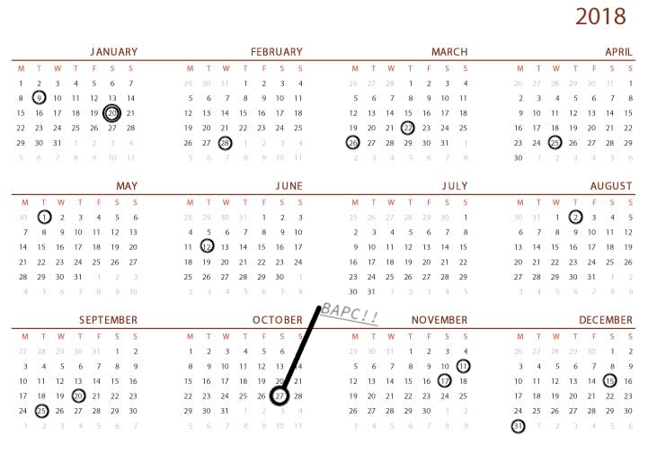

# Problem Set 2

## Problem A - ACM Contest Scoring

Our new contest submission system keeps a chronological log of all submissions made by each team during the contest. With each entry, it records the number of minutes into the competition at which the submission was received, the letter that identifies the relevant contest problem, and the result of testing the submission (designated for the sake of this problem simply as right or wrong). As an example, the following is a hypothetical log for a particular team:

3 E right
10 A wrong
30 C wrong
50 B wrong
100 A wrong
200 A right
250 C wrong
300 D right

The rank of a team relative to others is determined by a primary and secondary scoring measure calculated from the submission data. The primary measure is the number of problems that were solved. The secondary measure is based on a combination of time and penalties. Specifically, a team’s time score is equal to the sum of those submission times that resulted in right answers, plus a 20-minute penalty for each wrong submission of a problem that is ultimately solved. If no problems are solved, the time measure is 

.

In the above example, we see that this team successfully completed three problems: E on their first attempt (
 minutes into the contest); A on their third attempt at that problem ( minutes into the contest); and D on their first attempt at that problem ( minutes into the contest). This team’s time score (including penalties) is . This is computed to include  minutes for solving E,  minutes for solving A with an additional  penalty minutes for two earlier mistakes on that problem, and finally

 minutes for solving D. Note that the team also attempted problems B and C, but were never successful in solving those problems, and thus received no penalties for those attempts.

According to contest rules, after a team solves a particular problem, any further submissions of the same problem are ignored (and thus omitted from the log). Because times are discretized to whole minutes, there may be more than one submission showing the same number of minutes. In particular there could be more than one submission of the same problem in the same minute, but they are chronological, so only the last entry could possibly be correct. As a second example, consider the following submission log:

7 H right
15 B wrong
30 E wrong
35 E right
80 B wrong
80 B right
100 D wrong
100 C wrong
300 C right
300 D wrong

This team solved 4 problems, and their total time score (including penalties) is 502 with 7 minutes for H, 35 + 20 for E, 80 + 40 for B, and 300 + 20 for C.

**Input**
The input contains n lines for 0 <= n <= 100, with each line describing a particular log entry. A log entry has three parts: an integer m, with 1 <= m <= 300, designating the number of minutes at which a submission was received, an uppercase letter designating the problem, and either the word right or wrong. The integers will be in nondecreasing order and may contain repeats. After all the log entries is a line containing just the number -1

**Output**
Output two integers on a single line: the number of problems solved and the total time measure (including penalties).

Sample Input 1

3 E right
10 A wrong
30 C wrong
50 B wrong
100 A wrong
200 A right
250 C wrong
300 D right
-1

Sample Output 1

3 543

Sample Input 2

7 H right
15 B wrong
30 E wrong
35 E right
80 B wrong
80 B right
100 D wrong
100 C wrong
300 C right
300 D wrong
-1

Sample Output 2

4 502

## Problem B - Association for Computing Machinery

ACM (Association for Computing Machinery) organizes the International Collegiate Programming Contest (ICPC) worldwide every year.

In the ICPC, a team of three students is presented with a problem set that contains N problems of varying types and difficulty levels. The teams are not told which problems are easier (or harder). As there is only one single computer per team, each team has to decide which one of the N! possible problem solving orders that the team wants to use. This is called the “contest strategy” and teams who are expecting to do well in an ICPC should use the optimal contest strategy for their team.

However, when a contest has ‘First to Solve Problem [‘A’/‘B’/.../‘A’ + (N - 1)] award’ — like this ICPC SG Regional Contest 15 — sponsored by Kattis, then some of the teams may throw the optimal contest strategy out of the window in order to grab the (smaller) award.

**Input**

The input describes a hypothetical scenario of a 300 minute contest.

The first line contains two non-negative integers 2 <= N <= 13 and 0 <= p <= N-1. The integer N describes the number of problems in the problem set of this ACM ICPC and the integer is a 0-based index that describes the problem id that your team wants to solve first before attempting the other N-1 problems.

The next line contains N integers in the range between 1 and 999, inclusive. Each integer i describes the estimated number of minutes to solve problem id i according to your team. You have discussed with your team mates that your team will not put the same estimation for two different problems, so there is no ambiguity.

As an ACM ICPC duration is 5 hours, or 300 minutes, any estimation of strictly larger than 300 minutes for a certain problem j basically says that you estimate that your team cannot solve problem j during contest time.

In this problem, you can assume that all your team's estimations are perfectly accurate, ie. if your team estimates that your team needs 30 minutes to solve problem k, 270 minutes to solve another problem l, and have no idea how to solve the rest, and decides to solve problem k first followed by l, then after 30 minutes have elapsed from the start of contest, your team really gets an 'Accepted' verdict from Kattis for problem k, immediately switches to problem l for the next 270 minutes, gets another 'Accepted' verdict from Kattis for problem l at exactly 300 minutes (in this problem, submission at minute 300 is a valid submission). Thus you have 2 Accepted problems and the total penalty time of 30 + 300 = 330 minutes as per the ICPC rules.

**Output**

Print two integers *Num_AC* and *Penalty_Time* separated by a single space in one line.

*Num_AC* is the highest number of problems that your team can solve and *Penalty_Time* is the lowest penalty minutes that your team can get in order to solve *Num_AC* problems in this 300 minutes  ACM ICPC if your team insists to solve problem p first from the start of the contest and then use the remaining time to work on the other N-1 problems.

For the example scenario above, if your team decides to solve problem l first followed by k, then your team still
solves Num_AC = 2 Accepted problems, but with the total penalty of 270 + 300 = 570 minutes.

Sample Input 1

7 0
30 270 995 996 997 998 999

Sample Output 1

2 330

Sample Input 2

7 1
30 270 995 996 997 998 999

Sample Output 2

2 570

Sample Input 3

7 2
30 270 995 996 997 998 999

Sample Output 3

0 0

Sample Input 4

3 0
1 300 299

Sample Output 4

2 301

## Problem C - Popular Vote

In an election with more than two candidates, it is often the case that the winner (the candidate receiving the most votes) receives less than the majority of the votes. Given the results of an election, can you determine the winner, and whether the winner received more than half of the votes? 

**Input**

The first line of input contains a single positive integer T ≤ 500 indicating the number of test cases. The first line of each test case also contains a single positive integer n indicating the number of candidates in the election. This is followed by n lines, with the ith line containing a single nonnegative integer indicating the number of votes candidate i received.

There are at least 2 and no more than 10 candidates in each case, and each candidate will not receive more than 50 000 votes. There will be at least one vote cast in each election.

**Output**

Provide a line of output for each test case. If the winner receives more than half of the votes, print the phrase majority winner followed by the candidate number of the winner. If the winner does not receive more than half of the votes, print the phrase minority winner followed by the candidate number of the winner. If a winner cannot be determined because no single candidate has more vote than others, print the phrase no winner. The candidate numbers in each case are 1,2,...,n.

Sample Input 1

4
3
10
21
10
3
20
10
10
3
10
10
10
4
15
15
15
45

Sample Output 1

majority winner 2
minority winner 1
no winner
minority winner 4

## Problem D - Memory Match

You are playing the game "Memory Match".

This game revolves around a set of N picture cards. The cards are organized in pairs: there are N/2 different pictures, each picture occurring on exactly two cards.

At the beginning of the game, the cards are shuffled and laid face down on the table. Players then take turns in guessing a pair of cards with the same picture. Each turn consists of picking a face-down card and turning it over to reveal its picture, then picking another face-down card and turning that card over as well. If the pictures on the two turned cards are identical, the cards remain face-up, the player scores a point and may take another turn. If the pictures are different, both cards are turned face-down again and the turn goes to the next player.

It is now your turn! Given a description of all previous actions in the game, pick as many matching pairs as possible.

**Figure 1**: Illustration of the first example input. Only cards and have been matched correctly, all other cards are face-down. How many pairs can you score? 

**Input**

The first line contains an even integer N, the number of cards on the table (2 ≤ N ≤ 1000).

The second line contains an integer K, the number of turns played thus far in the game (0 ≤ K ≤ 1000).

The following K lines each describe a turn. A turn is described by integers C1 and C followed by words P1 and P2. The numbers C1 and Ca refer to card positions on the table (1 ≤ C1, Cz< N and C1 # C2). The words describe the pictures on the two selected cards. Each word consists of between 1 and 20 lowercase letters in range 'a' ...'?'. If P1 = Pz, the two cards stay face-up and the corresponding positions C1 and C2 may not be chosen again.

The input is such that at least two cards are still in facedown position.

**Output**

Output one line with an integer S, the number of matching pairs you can score with certainty.

Sample Input 1

8
5
1 3 earth sun
2 6 mars sun
6 3 sun sun
7 5 earth moon
2 7 mars earth

Sample Output 1

3

Sample Input 2 

10
6
1 2 moon earth
9 10 venus sun
8 7 moon venus
1 8 moon moon
4 10 sun sun
9 6 venus mars

Sample Output 2

3

Sample Input 3

8
2
1 3 moon earth
2 6 sun earth

Sample Output 3

1

## Problem E - Birthday Boy

Bobby has just joined a new company, and human resources has asked him to note his birthday on the office calendar. Bobby the Birthday Boy wants to feel special! Also, Bobby the Birthday Boy does not mind lying for attention.

He notices that the longer people have not celebrated a birthday or eaten cake, the more they like it when a new one comes around. So he wants to pick his birthday in such a way that the longest period of time without a birthday possible has just passed. Of course he does not want to share his birthday with any colleague, either.

Can you help him make up a fake birthday to make him feel as special as possible? Bobby does not care about leap years: you can assume every year is not a leap year, and that no one has a birthday on the 29th of February. In case of a tie, Bobby decides to fill in the date that is soonest (strictly) after the current date, the 27th of October, because that means he will get to celebrate his birthday as soon as possible.

**Figure 1**:Sample case . The calendar is from http://printablecalendarholidays.com. 

**Input**

• The first line has a number 1 ≤ n ≤ 100, the number of colleagues Bobby has in his new office.
• Then follow n lines, each line corresponding to one coworker. Each line gives the name of the colleague (using at most 20 upper- or lowercase letters a-z) separated from their birthday date by a space. The date is in format mm-dd.

**Output**

Print the fake birthday date (format: mm-dd) chosen by Bobby.

Sample Input 1

3
Henk 01-09
Roos 09-20
Pietje 11-11

Sample Output 1

09-19

Sample Input 2 

16
Henk 01-09
Luc 12-31
Jan 03-22
Roos 09-20
Pietje 11-11
Anne 02-28
Pierre 09-25
Dan 12-15
Lieze 11-17
Charlotte 05-01
Lenny 08-02
Marc 04-25
Martha 06-12
John 03-26
Matthew 01-20
John 01-20

Sample Output 2

08-01

Sample Input 3

3
JohnIII 04-29
JohnVI 10-28
JohnIIX 04-28

Sample Output 3

04-27

Sample Input 4

3
CharlesII 04-30
CharlesV 10-29
CharlesVII 04-29

Sample Output 4

10-28